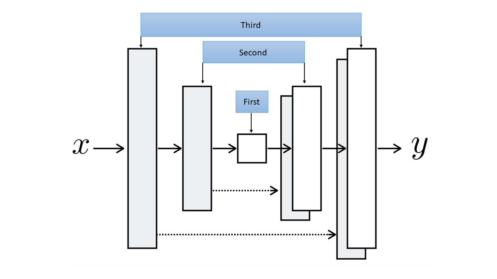

# Image Colorization Using Conditional GANs


## Problem Statement

The task of colourizing black and white photographs necessitates a lot of human input and hardcoding.

The goal is to create an end-to-end deep learning pipeline that can automate the task of image colorization by taking a black 
and white image as input and producing a colourized image as output.

## Final Model Output


[](https://colab.research.google.com/drive/1E0h9_KfBlsdtl_E1rlb0dKpzIsGvYRSA?authuser=3#scrollTo=t4QEsbHFODjK)

## Introduction to colorization problem

### RGB 

In RGB color space, there are 3 numbers for each 
pixel indicating how much red, green and blue given
pixel is.

In the following image , the leftmost image is
the "main image" and the other three are resectively
,red, blue and green channel and combining the three
channels we get "main image".


### L*A*B
In L*a*b color space the first channel L, encodes the Lightness of each pixel and when we visualize this channel it appears as a black and white image.
The *a and *b channels encode how much green-red and yellow-blue each pixel is, respectively.


## Approach

The solution to colorization problem was proposed in
[***Image-to-Image Translation with Conditional Adversarial Networks***](https://arxiv.org/abs/1611.07004) paper
, proposed a general solution to many image-to-image tasks in deep learning.

In this approach, we define two losses:L1 loss, 
which makes it a regression task, and 
an adversarial (GAN) loss,which helps to
solve the problem in an unsupervised manner.

## GAN Model
**Generative Adversarial Networks(GAN in short)** consist of two Artificial Neural Networks or Convolution Neural Networks models namely Generator and Discriminator which are trained against each other (and thus Adversarial).

In our problem , the generator model takes a grayscale image (1-channel image) and produces a 2-channel image, a channel for \*a and another for \*b.
The discriminator, takes these two produced channels and concatenates them with the input grayscale image and decides whether this new 3-channel image is fake or real. Of course the discriminator also needs to see some real images (3-channel images again in Lab color space) that are not produced by the generator and should learn that they are real. 

## Implementation

```python
# Importing Libraries
import os
import glob
import time
import numpy as np
from PIL import Image
from pathlib import Path
from tqdm.notebook import tqdm
import matplotlib.pyplot as plt
from skimage.color import rgb2lab, lab2rgb
```
```
import torch
from torch import nn, optim
from torchvision import transforms
from torchvision.utils import make_grid
from torch.utils.data import Dataset, DataLoader
from torchvision.utils import save_image

```

### 1. Loading Images

We have used a total of 10000 images from COCO dataset out of which 8000 images were used for training the model and 2000 images were usedfor validation and testing of model.

```python
!pip install -U fastai
```

```python
from fastai.data.external import untar_data, URLs
coco_path = untar_data(URLs.COCO_SAMPLE)
coco_path = str(coco_path) + "/train_sample"
paths = glob.glob(coco_path + "/*.jpg") # Grabbing all the image file names
np.random.seed(123)
paths_subset = np.random.choice(paths, 10_000, replace=False) # choosing 10000 images randomly
rand_idxs = np.random.permutation(10_000)
train_idxs = rand_idxs[:8000] # choosing the first 8000 as training set
val_idxs = rand_idxs[8000:] # choosing last 2000 as validation set
train_paths = paths_subset[train_idxs]
val_paths = paths_subset[val_idxs]
print(len(train_paths), len(val_paths))
```

```python
# Shows Images
_, axes = plt.subplots(4, 4, figsize=(10, 10))
for ax, img_path in zip(axes.flatten(), train_paths):
    ax.imshow(Image.open(img_path))
    ax.axis("off")
```


### 2. Making Training and Validation datasets and dataloaders

```python
SIZE = 256
class DataPrep(Dataset):
    def __init__(self, paths, split='train'):
        if split == 'train':
            self.transforms = transforms.Compose([
                transforms.Resize((SIZE, SIZE),  Image.BICUBIC),
                transforms.RandomHorizontalFlip(), # A little data augmentation!
            ])
        elif split == 'val':
            self.transforms = transforms.Resize((SIZE, SIZE),  Image.BICUBIC)
        
        self.split = split
        self.size = SIZE
        self.paths = paths
    
    def __getitem__(self, idx):
        img = Image.open(self.paths[idx]).convert("RGB")
        img = self.transforms(img)
        img = np.array(img)
        img_lab = rgb2lab(img).astype("float32") # Converting RGB to L*a*b
        img_lab = transforms.ToTensor()(img_lab)
        L = img_lab[[0], ...] / 50. - 1. # Between -1 and 1
        ab = img_lab[[1, 2], ...] / 110. # Between -1 and 1
        
        return {'L': L, 'ab': ab}
    
    def __len__(self):
        return len(self.paths)
```

```python
batch_size = 16
shuffle = True
workers = 2
train_dataset = DataPrep(train_paths)
val_dataset = DataPrep(val_paths)
train_loader= DataLoader(train_dataset,batch_size = batch_size,shuffle = shuffle,num_workers=workers,split = 'train')
val_loader= DataLoader(val_dataset,batch_size = batch_size,shuffle = shuffle,num_workers=workers,split = 'test')

```

```python
data = next(iter(train_dl))
Ls, abs_ = data['L'], data['ab']
print(Ls.shape, abs_.shape)
print(len(train_dl), len(val_dl))

```
### => For Generator and Discriminator model following convention is used:

Ck denote a Convolution-BatchNorm-ReLU layer with k filters.

CDk denotes a Convolution-BatchNorm-Dropout-ReLU layer with a dropout rate of 50%.

All convolutions are 4× 4 spatial filters applied with stride 2.

Convolutions in the encoder, and in the discriminator, downsampleby a factor of 2, whereas in the decoder they upsample by a factor of 2.

### 3. Generator Model 
### Generator architectures:

The encoder-decoder architecture consists of:

Encoder:
C64-C128-C256-C512-C512-C512-C512-C512

Decoder:
CD512-CD512-CD512-C512-C256-C128-C64



```python
class GeneratorBlock(nn.Module):
  def __init__(self,in_channels,out_channels,batchnorm = False,up = False,use_dropout = False):
    super(GeneratorBlock,self).__init__()
    self.block1 = nn.Sequential(
        nn.Conv2d(in_channels,out_channels,4,2,1,bias=False)
        if up == False else nn.ConvTranspose2d(in_channels,out_channels,4,2,1,bias = False),
    )
    self.batchnorm = batchnorm
    if batchnorm:
      self.block2 = nn.BatchNorm2d(out_channels)

    if up == True:
      self.block3= nn.ReLU()
    else:
      self.block3 = nn.LeakyReLU(0.2)

    self.use_dropout = use_dropout
    if use_dropout:
      self.block4 = nn.Dropout(0.5)


  def forward(self,x):
    x = self.block1(x)
    if self.batchnorm:
      x = self.block2(x)
    x = self.block3(x)
    if self.use_dropout:
      return self.block4(x)
    else:
      return x

```

```python

class Generator(nn.Module):
  def __init__(self,in_channels = 1):
    super(Generator,self).__init__()
    self.d1 = GeneratorBlock(1,64,False,False,False)
    self.d2 = GeneratorBlock(64,128,True,False,False)
    self.d3 = GeneratorBlock(128,256,True,False,False)
    self.d4 = GeneratorBlock(256,512,True,False,False)
    self.d5 = GeneratorBlock(512,512,True,False,False)
    self.d6 = GeneratorBlock(512,512,True,False,False)
    self.d7 = GeneratorBlock(512,512,True,False,False)
    self.bottom = nn.Sequential(
        nn.Conv2d(512,512,4,2,1),
        nn.LeakyReLU(0.2),
    )
    
    self.u1 = GeneratorBlock(512,512,True,True,True)
    self.u2 = GeneratorBlock(1024,512,True,True,True)
    self.u3 = GeneratorBlock(1024,512,True,True,True)
    self.u4 = GeneratorBlock(1024,512,True,True,False)
    self.u5 = GeneratorBlock(1024,256,True,True,False)
    self.u6 = GeneratorBlock(512,128,True,True,False)
    self.u7 = GeneratorBlock(256,64,True,True,False)
    self.up = nn.Sequential(
        nn.ConvTranspose2d(128,2,4,2,1),
        nn.Tanh(),
    )

  def forward(self,x):
    down1 = self.d1(x)
    down2 = self.d2(down1)
    down3 = self.d3(down2)
    down4 = self.d4(down3)
    down5 = self.d5(down4)
    down6 = self.d6(down5)
    down7 = self.d7(down6)
    down8 = self.bottom(down7)
    up1 = self.u1(down8)
    up2 = self.u2(torch.concat([up1,down7],1))
    up3 = self.u3(torch.concat([up2,down6],1))
    up4 = self.u4(torch.concat([up3,down5],1))
    up5 = self.u5(torch.concat([up4,down4],1))
    up6 = self.u6(torch.concat([up5,down3],1))
    up7 = self.u7(torch.concat([up6,down2],1))
    up8 = self.up(torch.concat([up7,down1],1))

    return up8

```
```python
    # To visulalize Generator
    generator = Generator()
    generator
```

### 4. Discriminator Model

#### Discriminator architecture

The 70 × 70 discriminator architecture is:

C64-C128-C256-C512

After the last layer, a convolution is applied to map to
a 1-dimensional output, followed by a Sigmoid function.
As an exception to the above notation, BatchNorm is not
applied to the first C64 layer. All ReLUs are leaky, with
slope 0.2.

All other discriminators follow the same basic architecture, with depth varied to modify the receptive field size:

1 × 1 discriminator:

C64-C128 (note, in this special case, all convolutions are 1 × 1 spatial filters)

16 × 16 discriminator:

C64-C128

286 × 286 discriminator:

C64-C128-C256-C512-C512-C512

```python
class DiscriminatorBlock(nn.Module):
  def __init__(self,in_channels,out_channels,stride):
    super(DiscriminatorBlock,self).__init__()
    self.conv = nn.Sequential(
        nn.Conv2d(in_channels,out_channels,4,stride,bias = False,padding=1),
        nn.BatchNorm2d(out_channels),
        nn.LeakyReLU(0.2)
    )

  def forward(self,x):
    return self.conv(x);

```

```python
class Discriminator(nn.Module):
  def __init__(self,in_channels = 3):
    super(Discriminator,self).__init__()
    self.block1 = nn.Sequential(nn.Conv2d(3,64,4,2,1),nn.LeakyReLU(0.2))
    self.block2 = DiscriminatorBlock(64,128,2)
    self.block3 = DiscriminatorBlock(128,256,2)
    self.block4 = DiscriminatorBlock(256,512,1)
    self.block5 = nn.Conv2d(512,1,4,1,1)

  def forward(self,y):
    x = self.block1(y)
    x = self.block2(x)
    x = self.block3(x)
    x = self.block4(x)
    return self.block5(x)
    
```
```python
    # To visulalize Discriminator
    discriminator = Discriminator(3)
    discriminator
```
### 5. Utility Functions

####  5.1 ShowSamples

This function is takes in Validation data, put the 'L' channel in the generator to generate \*a
and \*b channel and then recombine then to generate fake_image and finally plot the grayscale image i.e the input,
fake_image and real_image.

```python
def ShowSamples(generator, val_data, folder, epoch= -1, SAVE = True):
    data = next(iter(val_data))
    L = data['L']
    ab = data['ab']
    L=L.to(device)
    ab=ab.to(device)
    # print(ab.shape)
    generator.eval()
    with torch.no_grad():
        fake_ab = generator(L)
    generator.train()
    real_images = lab_to_rgb(L, ab)
    fake_images = lab_to_rgb(L, fake_ab.detach())

    fig = plt.figure(figsize=(15, 8))
    val = 1
    for i in range(3):
      for j in range(5):
        ax = plt.subplot(3,5,val)
        if i==0 :
          if j==0:
            ax.set_ylabel('Grayscale', size='large')
          ax.imshow(L[j][0].cpu(),cmap = 'gray')
        if i==1:
          if j==0:
            ax.set_ylabel('Fake_images', size='large')
          ax.imshow(fake_images[j])
        if i==2:
          if j==0:
            ax.set_ylabel('Real_images', size='large')
          ax.imshow(real_images[j])
        val+=1
    plt.show()
    if SAVE:
        fig.savefig(folder + f"/Results_After_Epoch_{epoch}.png")
```

#### 5.2 VisulizeLoss

This function is used to plot Generator_loss or Discriminator_loss.

```python
def VisualizeLoss(Arr, folder, epoch, gen, dis, SAVE = True):
    ob=[]
    for i in Arr:
      ob.append(i.cpu().detach().numpy())
    x=(range(0,len(Arr)))
    plt.figure(figsize = (12,10))
    plt.plot(x,ob)
    if dis:
      str = "Discriminator"
    if gen:
      str = "Generator"
    plt.xlabel("Number of Iterations")
    plt.ylabel(str + " Loss")
    if SAVE:
        plt.savefig(folder + f"/{str}_Loss_After_Epoch_{epoch}.png")
    plt.show()
```
#### 5.3 lab_to_rgb
This function take is L*A*B color as input and provide its corresponding RGB output.

```python
def lab_to_rgb(L, ab):
    """
    Takes a batch of images
    """
    L = (L + 1.) * 50.
    ab = ab * 110.
    Lab = torch.cat([L, ab], dim=1).permute(0, 2, 3, 1).cpu().detach().numpy()
    rgb_imgs = []
    for img in Lab:
        img_rgb = lab2rgb(img)
        rgb_imgs.append(img_rgb)
    return np.stack(rgb_imgs, axis=0)
```

#### 5.4 SaveCheckpoint and LoadCheckpoint

```python
def SaveCheckpoint(model, optimizer, epoch, filename):
    print("=> Saving checkpoint")
    checkpoint = {
        "state_dict": model.state_dict(),
        "optimizer": optimizer.state_dict(),
        "epoch":epoch,
        "DISC_LOSS" : Discriminator_loss,
        "GEN_LOSS" : Generator_loss
    }
    torch.save(checkpoint, filename)
```
```python
def load_checkpoint(checkpoint_file, model, optimizer, lr):
    print("=> Loading checkpoint")
    checkpoint = torch.load(checkpoint_file, map_location=device)
    model.load_state_dict(checkpoint["state_dict"])
    optimizer.load_state_dict(checkpoint["optimizer"])
    global epoch
    global Discriminator_loss
    global Generator_loss
    epoch = checkpoint["epoch"]
    Discriminator_loss = checkpoint["DISC_LOSS"].copy()
    Generator_loss = checkpoint["GEN_LOSS"].copy()

    for param_group in optimizer.param_groups:
        param_group["lr"] = lr
```
#### 5.5* Mounting Google Drive for saving checkpoints and images in Collab
Put the following piece of code at start to mount GDrive on your **Collab Notebooks**.

```python
from google.colab import drive
drive.mount('/content/drive')
```

### 6. Putting our Model Together

#### 6.1 Declaring path for input and output folders and checkpoints for generator and discriminator

```python
inputFolder = "/content/drive/MyDrive/ColabNotebooks/model"
outputFolder = "/content/drive/MyDrive/ColabNotebooks/Results"
checkpointPathDiscriminator = inputFolder+"/disc.pth.tar"
checkpointPathGenerator = inputFolder+"/gen.pth.tar"
```

#### 6.2 Calling CUDA
```python
device = torch.device("cuda:0" if torch.cuda.is_available() else "cpu")   
device
```


#### 6.3 Hyperparameters
```python
lr_G=2e-4              # Learning rate of generators
lr_D=2e-4              # Learning rate of discriminstors
#betas are used for computing running averages of gradient and its square (default: (0.9, 0.999))
beta1=0.5               
beta2=0.999
lambda_L1=100.0        #lambda parameter controls the amount of regularization applied to the model.
epoch = 0
epochs = 250           # Total number of times model runs
```

```python
shuffle=True
saveimages= True
pin_memory = True
loadModel= True
SaveModel = True
```
```python
Discriminator_loss=[]
Generator_loss=[]
G_agg=0
D_agg=0
```
#### 6.4 Loading generator and discriminator models on the device

```python
G = Generator().to(device)
D = Discriminator().to(device)
```

Optimizers 
```python
G_optimizer = torch.optim.Adam(G.parameters(), lr_G,betas=(beta1,beta2))
D_optimizer = torch.optim.Adam(D.parameters(), lr_D,betas=(beta1,beta2))
criterion_gan = nn.BCEWithLogitsLoss()
criterion_pixelwise = nn.L1Loss()

```

#### 6.5 Loading Model if present
```python
if loadModel:
    load_checkpoint(checkpointPathGenerator, G, G_optimizer, lr_G)
    load_checkpoint(checkpointPathDiscriminator, D, D_optimizer, lr_D)
```

#### 6.6 Main training function

This is the part of the code where we will be training our model. 

First we will be training our discriminator using following steps:

1. Set the gradients of the optimizer **(D_optimizer)** of discriminator to zero.

2. We then produce fake colors by passing 'L' channel as an input to generator and then concat it with 'L'channel to generate **fake_img**.

Note: Make sure to detach **fake_img** from the generator's graph so that they act as a constant to the discriminator, like normal images.

3. Then we feed these generated **fake_img** to the discriminator and label them as **D_fake** and real **real_img** to the discriminator and label them as **D_real**.

4. We add up the two losses **(D_fake_loss, D_real_loss)** for fake and real and take the average and then call the backward on the **total_loss**.

Now we will train our generator using following steps:

1. Set the gradients of the optimizer **(G_optimizer)** of generator to zero.

2. We feed the discriminator the fake image and try to fool it by assigning real labels to them and calculating the adversarial loss **( G_fake_loss)**.

3. We use **L1_loss** and compute the distance between the predicted two channels **(fake_)** and the target two channels**(torch.concat([L,ab],1))** and multiply this loss by a coefficient **lambda_L1=100.0** to balance the two losses and then add this loss to the adversarial loss.

=>   G_loss = G_fake_loss + lambda_L1 * L1_loss

4. Now we call backward on this loss **(G_loss)** and **D_optimizer.step()** that makes the optimizer iterate over all parameters it is supposed to update and use their internally stored grad to update their values.

Finally, we store the **D_agg** in **Discriminator_loss** and **G_agg** in **Generator_loss** and in the next few lines we generate plots for discriminator loss,
generator loss and save some sample images generated at the current sate of the model for future reference.

```python
epoch+=1;
while epoch <= epochs:
  for i,data in enumerate(train_loader):
    L = data['L'].to(device)
    ab = data['ab'].to(device)

    # TRAIN DISCRIMINATOR
    D_optimizer.zero_grad()

    fake_colour = G(L)

    fake_img = torch.cat([L,fake_colour],1).detach()
    real_img = torch.cat([L,ab],1)
    
    D_fake= D(fake_img)  #changes_applied
    D_real= D(real_img) #changes applied
    D_fake_loss = criterion_gan(D_fake,torch.zeros_like(D_fake))
    D_real_loss = criterion_gan(D_real,torch.ones_like(D_fake))

    total_loss = (D_real_loss+D_fake_loss)*0.5;

    #total_loss.requires_grad = True

    D_agg = total_loss
  
    #d_scaler.scale(total_loss).backward()
    total_loss.backward()

    D_optimizer.step()

    # TRAIN GENERATOR

    G_optimizer.zero_grad()

    fake_colour = G(L)
    fake_ = torch.cat([L,fake_colour],1)
    fake_patch=D(fake_)
   
    G_fake_loss = criterion_gan(fake_patch,torch.ones_like(fake_patch)) # changes applied

    L1_loss = criterion_pixelwise(fake_,torch.concat([L,ab],1))  # changes applied

    G_loss = G_fake_loss + lambda_L1 * L1_loss

    G_agg=G_loss

    G_loss.backward()

    G_optimizer.step()

    Discriminator_loss.append(D_agg)
    Generator_loss.append(G_agg)

  if(epoch % 5 == 0):
    ShowSamples(G, val_loader,outputFolder,epoch,saveimages)
  if SaveModel:
        SaveCheckpoint(G, G_optimizer, epoch, filename=checkpointPathGenerator)
        SaveCheckpoint(D, D_optimizer, epoch, filename=checkpointPathDiscriminator)
  if epoch % 5 == 0:
        print("Generator Loss\n")
        VisualizeLoss(Generator_loss,outputFolder,epoch,True,False,saveimages)
        print("Discriminator Loss\n")
        VisualizeLoss(Discriminator_loss,outputFolder,epoch,False,True,saveimages)
  print("Epochs done: ",epoch)
  epoch+=1
```
#### 6.6 Visualization of generator loss, discriminator loss and Sample images using both training and test data

```python
# Can be used for plotting loss of generator at any epoch
VisualizeLoss(Generator_loss,outputFolder,epoch,False,False)
```

https://user-images.githubusercontent.com/59966711/176663216-5416dc4c-6512-420e-b08b-04a30e4562b3.mp4

```python
# Can be used for plotting loss of discriminator at any epoch
VisualizeLoss(Discriminator_loss,outputFolder,epoch,False,False)
```
https://user-images.githubusercontent.com/59966711/176663251-13548c9e-c912-460b-8105-7be071e99471.mp4

```python
num = 5

for n in range(num):
    ShowSamples(G, train_loader,outputFolder,epoch,False)
    
for n in range(num):
    ShowSamples(G, val_loader,outputFolder,epoch,False)
```

https://user-images.githubusercontent.com/59966711/176663605-b85df483-0a47-4db8-93fa-5a60844db2e8.mp4


